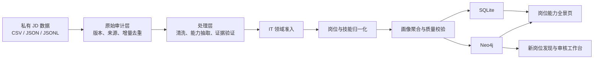

# 可信岗位图谱 Agent

面向招聘岗位数据的可审计知识图谱流水线：从原始 JD 导入、清洗去重、IT 领域准入、岗位与技能归一化，到可信证据聚合、SQLite/Neo4j 发布，以及岗位全景和新岗位发现前端。

> **公开仓库边界**：本仓库只包含处理逻辑、算法规则、安全的示例配置和前端源码；不包含任何原始招聘数据、运行结果、模型权重、API Key、Neo4j 密码或本机配置。


## 队员快速查看前端

如果目的是统一前端风格，不需要复制完整的 12 GB Neo4j 数据库，也不需要运行原始数据处理流水线。

项目负责人需要私下发送脱敏展示包 `trusted-job-graph-display.zip`。队员克隆本仓库后，在 Neo4j 中新建一个空数据库，并执行：

```powershell
Copy-Item config\neo4j_connection.example.json config\neo4j_connection.json

python display_graph_handoff.py import `
  --package "C:\path\to\display_graph.json" `
  --neo4j-config config\neo4j_connection.json

python display_graph_handoff.py serve `
  --neo4j-config config\neo4j_connection.json
```

浏览器打开 <http://127.0.0.1:8010/>。

展示包只包含岗位、岗位族、归一化技能、岗位画像和时间快照，不包含原始 JD、真实公司、薪资、招聘链接、证据原文及处理过程中的中间节点。技能证据详情为空属于预期行为。

完整步骤和数据边界见 [队员前端联调说明](TEAM_HANDOFF.md)。展示包属于私下交付物，不上传到公开 GitHub。

## 目录

- [队员快速查看前端](#队员快速查看前端)
- [项目能力](#项目能力)
- [系统架构](#系统架构)
- [可信与可审计设计](#可信与可审计设计)
- [快速开始：本地 SQLite 模式](#快速开始本地-sqlite-模式)
- [Neo4j 增量处理模式](#neo4j-增量处理模式)
- [五维能力提取](#五维能力提取)
- [岗位归一化](#岗位归一化)
- [新岗位发现工作台](#新岗位发现工作台)
- [输入字段](#输入字段)
- [输出产物](#输出产物)
- [HTTP API](#http-api)
- [项目结构](#项目结构)
- [安全与数据边界](#安全与数据边界)
- [验证与排错](#验证与排错)
- [许可证](#许可证)

## 项目能力

- **多源原始 JD 接入**：增量导入 CSV、JSON、JSONL，自动适配常见中英文字段名。
- **可重跑与可追踪**：按来源文件、职位和 JD 版本建立稳定标识，保留导入批次与当前版本指针。
- **IT 岗位准入**：联合岗位族、职位名、职责文本、行业信息、正反证据和语义相似度，输出 `IT`、`NON_IT` 或 `UNCERTAIN`。
- **可信能力证据**：从已有能力分析或 JD 原文抽取技能候选，回到原文验证证据，降低模板文本和无依据结果的影响。
- **岗位与技能归一化**：支持精确别名、词法规则、向量召回、硬约束和人工复核候选。
- **时间化岗位画像**：按岗位、行业、职级和时间窗口聚合技能需求，区分必备、常见和加分技能。
- **双存储后端**：轻量演示可直接使用 SQLite；正式增量流程可发布到 Neo4j。
- **两个浏览器前端**：岗位能力全景页，以及独立的新岗位候选分析与人工审核工作台。

## 系统架构



仓库提供两种运行方式：

1. **本地构建模式**：从按岗位整理的 CSV 直接生成 SQLite、Neo4j 导入文件和全景页，适合试跑、演示和离线分析。
2. **Neo4j 增量模式**：先建立原始审计层，再运行能力处理、领域准入、归一化、验证和版本发布，适合持续接收新数据。

## 可信与可审计设计

这个项目不会把模型输出直接当作事实。主要约束包括：

- 每个技能结论尽量关联原始 JD 中的证据片段和证据状态。
- 精确重复与近似重复 JD 会被识别，模板化内容会降权。
- 跨公司支持度、时间衰减和岗位相关度共同参与画像聚合。
- IT 准入保留分数、命中证据组和排除原因，便于抽样复核。
- 归一化结果先写入独立运行版本；使用 `--publish` 后才切换活动版本。
- 新岗位候选和人工决定写入独立审核子图，不直接修改正式岗位图谱。

## 环境要求

- Python 3.10 或更高版本
- pip
- Neo4j：仅 Neo4j 流程需要；SQLite 模式不需要
- 可选的 OpenAI 兼容大模型接口：仅能力补全或新岗位 AI 复核需要

完整语义归一化依赖：

- `numpy`
- `sentence-transformers`
- `faiss-cpu`

首次加载在线向量模型时可能需要网络。也可以使用本地模型路径，或在岗位归一化实验中选择无需下载模型的 `hashing` 嵌入器。

## 安装

```bash
git clone https://github.com/qingyuw612-cpu/trusted-job-graph.git
cd trusted-job-graph

python -m venv .venv
```

Windows PowerShell：

```powershell
.\.venv\Scripts\Activate.ps1
python -m pip install --upgrade pip
pip install -r requirements.txt
```

macOS / Linux：

```bash
source .venv/bin/activate
python -m pip install --upgrade pip
pip install -r requirements.txt
```

## 快速开始：本地 SQLite 模式

这是最短的体验路径，不要求安装或启动 Neo4j。该构建入口读取 CSV，至少需要可识别的职位名或职位描述。

### 1. 构建图谱

```powershell
python run_trusted_graph_agent.py build `
  --input-dir "C:\private-data\job-csv" `
  --output-dir ".\output\local_graph" `
  --all-files `
  --it-only
```

macOS / Linux 请使用反斜杠续行，或将命令写成一行：

```bash
python run_trusted_graph_agent.py build \
  --input-dir "/private-data/job-csv" \
  --output-dir "./output/local_graph" \
  --all-files \
  --it-only
```

常用构建参数：

| 参数 | 作用 |
| --- | --- |
| `--all-files` | 处理输入目录中的全部 CSV；不加时只跑内置示例筛选规则 |
| `--include PATTERN` | 按相对路径、文件名或片段筛选，可重复传入 |
| `--max-rows-per-file 0` | 每个 CSV 的最大保留行数；`0` 表示不限制 |
| `--group-by-file-role` | 将 CSV 文件名优先作为标准岗位 |
| `--it-only` | 只处理内置 IT 岗位分类表覆盖的文件 |
| `--half-life-months 12` | 技能需求时间衰减半衰期 |
| `--llm-endpoint URL` | 可选的技能抽取 Webhook；失败时回退到本地规则 |

构建成功后，输出目录包含 `knowledge_graph.db`、`knowledge_graph.json`、`run_manifest.json`、质量校验报告、Neo4j 导入文件和 `panorama.html`。

### 2. 启动全景页

```powershell
python run_trusted_graph_agent.py serve `
  --output-dir ".\output\local_graph" `
  --backend sqlite `
  --host 127.0.0.1 `
  --port 8010
```

浏览器打开 <http://127.0.0.1:8010/>。

也可以一步完成构建和启动：

```powershell
python run_trusted_graph_agent.py demo --input-dir "C:\private-data\job-csv" --output-dir ".\output\local_graph" --all-files
```

## Neo4j 增量处理模式

### 1. 创建本地配置

复制示例文件，不要直接修改或提交示例：

```powershell
Copy-Item config\neo4j_connection.example.json config\neo4j_connection.json
Copy-Item raw_jd_layer\config.example.json raw_jd_layer\config.json
```

macOS / Linux：

```bash
cp config/neo4j_connection.example.json config/neo4j_connection.json
cp raw_jd_layer/config.example.json raw_jd_layer/config.json
```

编辑本地文件：

- `config/neo4j_connection.json`：填写 Neo4j 地址、数据库名、用户名和密码。
- `raw_jd_layer/config.json`：填写私有数据根目录、默认平台名、批量大小和允许扩展名。
- `instance_dir`、`import_dir`、`cypher_shell`、`java_home` 只在使用本机 Neo4j 导入或维护脚本时需要。

这些真实配置已被 `.gitignore` 排除。

### 2. 导入前预检

```powershell
python raw_jd_layer/importer.py `
  --config raw_jd_layer/config.json `
  --neo4j-config config/neo4j_connection.json `
  --check-only
```

查看已导入状态：

```powershell
python raw_jd_layer/importer.py --neo4j-config config/neo4j_connection.json --status-only
```

### 3. 运行完整增量流水线

```powershell
python run_incremental_knowledge_graph.py `
  --source "C:\private-data\new-batch" `
  --platform "来源平台" `
  --neo4j-config config\neo4j_connection.json `
  --processing-batch-size 200 `
  --batch-size 100 `
  --publish
```

该入口依次完成：原始数据增量导入、IT 领域判定、仅对 IT 岗位进行能力分析回标、岗位映射、技能归一化、质量验证、可选发布，以及发布后的自动新岗位与旧岗位能力变化发现。使用 `--publish` 时，第 7 阶段默认生成新岗位候选、观察名单，以及旧岗位能力上升、下降、新增、消失候选和审核队列。非 IT 与待确认岗位不会再生成能力候选和证据边。

“能力消失”只表示近期窗口未再观察到足够证据，会进入人工复核，不会自动删除正式图谱中的能力关系。

当前项目的前程无忧数据已经处理完成。以后只处理猎聘时，把新文件替换到
`D:\qing\tiaozhan\2026数据51job\liepin_jobs_2026_能力提取结果.csv`，然后运行：

```powershell
python run_incremental_knowledge_graph.py `
  --source "D:\qing\tiaozhan\2026数据51job\liepin_jobs_2026_能力提取结果.csv" `
  --platform "猎聘" `
  --processing-batch-size 200 `
  --publish
```

入口会为平台设置独立来源命名空间，并在能力处理读数异常、存在待大模型记录或处理失败时阻止发布。

建议先去掉 `--publish` 试跑并检查报告，确认无误后再发布。其他常用选项：

- `--skip-import`：数据已经位于原始层时跳过导入。
- `--force-import`：字段适配规则变化后重新导入相同文件。
- `--skip-normalization`：只处理导入和能力，不运行向量归一化。
- `--limit N`：只处理当前版本的前 N 条，适合小规模检查。
- `--llm-endpoint URL`：为缺少已有能力分析的记录调用兼容 Webhook。
- `--work-dir PATH`：指定本次处理中间结果目录。
- `--skip-new-role-discovery`：发布图谱，但跳过新岗位与旧岗位能力变化发现阶段。
- `--new-role-llm-mode off|auto|required`：控制候选语义复核；默认 `auto`。
- `--new-role-limit N`：限制送入语义复核的候选数量，默认 50。
- `--ability-change-limit N`：限制送入语义复核的旧岗位能力变化候选数量，默认 5；设为 0 可关闭能力变化分析。
- `--new-role-data-root PATH`：指定发现任务、候选和审核队列目录。

流水线在工作目录写入 `incremental_pipeline_report.json`。如果第 7 阶段失败，已成功发布的活动图谱不会回滚，但流水线报告会标记为失败并保留诊断信息。

### 4. 使用 Neo4j 作为全景页后端

```powershell
python run_trusted_graph_agent.py serve `
  --output-dir ".\output\local_graph" `
  --backend neo4j `
  --neo4j-config config\neo4j_connection.json `
  --host 127.0.0.1 `
  --port 8010
```

`--backend auto` 会在提供可用 Neo4j 配置时优先选择 Neo4j，否则使用输出目录中的 SQLite 数据库。

## 五维能力提取

如果原始 JD 没有“能力提取结果”或 `ability_analysis` 字段，可以通过 OpenAI 兼容接口预先生成五维能力结果：

```powershell
$env:ABILITY_LLM_BASE_URL = "https://your-provider.example/v1"
$env:ABILITY_LLM_API_KEY = "your-api-key"
$env:ABILITY_LLM_MODEL = "your-model"

python extract_five_dimension_abilities.py `
  --input "C:\private-data\jobs.jsonl" `
  --output "C:\private-data\jobs-with-abilities.jsonl" `
  --workers 4
```

该工具支持 CSV、JSON、JSONL，提供失败重试和 JSONL 断点缓存。API Key 应只通过环境变量或本机密钥管理工具提供，禁止写入仓库。

## 岗位归一化

独立岗位归一化入口位于 `role_normalization_project/`。它将精确匹配、向量召回、词法相似度和硬约束结合起来，并将低置信度结果保留给人工复核。

无需下载语义模型的快速试跑：

```powershell
python role_normalization_project\cli.py `
  --input "C:\private-data\jobs.csv" `
  --output-dir ".\output\role_normalization" `
  --embedder hashing `
  --title-column "职位名称" `
  --jd-column "职位描述"
```

使用语义模型：

```powershell
python role_normalization_project\cli.py `
  --input "C:\private-data\jobs.csv" `
  --output-dir ".\output\role_normalization" `
  --embedder sentence-transformer `
  --model "BAAI/bge-small-zh-v1.5"
```

输入也可以是目录；使用 `--recursive` 递归扫描 CSV，使用 `--overwrite` 明确允许覆盖已有结果。

## 新岗位发现工作台

工作台只读分析 Neo4j 正式图谱，并将运行状态、候选结果和人工决定保存到独立位置。
完整增量流水线发布后会自动调用同一套发现引擎；以下命令用于独立检查、查看和人工审核。

先检查环境：

```powershell
python -m new_role_discovery.app `
  --neo4j-config config\neo4j_connection.json `
  --data-root ".\output\role_evolution_workbench_v2" `
  --check
```

启动服务：

```powershell
python -m new_role_discovery.app `
  --neo4j-config config\neo4j_connection.json `
  --data-root ".\output\role_evolution_workbench_v2" `
  --host 127.0.0.1 `
  --port 8070
```

浏览器打开 <http://127.0.0.1:8070/>。

如需启用内置 Qwen 复核器，在当前终端设置：

```powershell
$env:IFLYTEK_MAAS_API_KEY = "your-api-key"
```

不配置 Key 时仍可使用不依赖外部模型的分析能力。工作台默认仅监听 `127.0.0.1`，不应直接暴露到公网。

## 输入字段

### 本地 SQLite 构建入口

`run_trusted_graph_agent.py build` 当前读取 CSV，并直接识别下列常用字段：

| 类型 | 字段示例 |
| --- | --- |
| 核心字段 | `职位名称`、`职位描述` |
| 标识 | `jobID`、`companyID` |
| 公司 | `公司全称`、`行业类型` |
| 岗位属性 | `职位标签`、`经验要求`、`学历要求`、`薪水`、`工作地区` |
| 时间 | `时间` |
| 可选能力结果 | `能力分析结果` |

职位名称和职位描述不能同时为空。不同岗位可放在不同子目录或 CSV 中；使用 `--group-by-file-role` 时，文件名会优先作为标准岗位。

### Neo4j 原始导入入口

`raw_jd_layer/importer.py` 支持 CSV、JSON、JSONL，并兼容常见别名，例如：

- 职位：`职位ID`、`job_id`、`职位名称`、`job_title`、`JD全文`、`description`
- 公司：`公司全称`、`company_name`、`公司行业`、`industry`
- 要求：`学历要求`、`工作经验`、`salary`、`location`
- 时间：`发布日期`、`publish_time`、`collected_at`
- 来源：`source_platform`、`platform`、`职位详情链接`
- 能力：`能力提取结果`、`ability_analysis`、`skill_tags`

正式导入前应始终使用 `--check-only` 检查编码、格式和字段覆盖情况。

## 输出产物

所有运行产物默认位于 `output/`，并被 Git 忽略。不同流程可能生成以下内容：

| 产物 | 用途 |
| --- | --- |
| `knowledge_graph.db` | 本地 SQLite 图谱与 API 数据源 |
| `knowledge_graph.json` | 图谱的结构化导出 |
| `run_manifest.json` | 运行参数、状态迁移、告警和汇总指标 |
| `validation_report.json` | 自动质量校验结果 |
| `neo4j/` | Neo4j 分阶段导入文件 |
| `panorama.html` | 可由本地 API 提供数据的岗位全景前端 |
| 增量运行报告 | 导入、处理、归一化和发布阶段的统计与错误信息 |
| 新岗位工作台目录 | 候选分析任务、报告和人工审核状态 |

不要将这些产物提交到公开仓库；它们可能包含由原始 JD 派生出的敏感信息。

## HTTP API

岗位全景服务提供的主要接口：

| 方法 | 路径 | 说明 |
| --- | --- | --- |
| `GET` | `/api/health` | 服务和后端健康状态 |
| `GET` | `/api/v1/facets` | 页面筛选维度 |
| `GET` | `/api/v1/industries` | 行业列表 |
| `GET` | `/api/v1/roles` | 岗位列表 |
| `GET` | `/api/v1/graph/panorama` | 全景图数据 |
| `GET` | `/api/v1/roles/{id}/profiles/latest` | 岗位最新画像 |
| `GET` | `/api/v1/roles/{id}/evolution` | 岗位演化数据 |
| `GET` | `/api/v1/roles/{id}/timeline` | 岗位时间线 |
| `GET` | `/api/v1/skills/{id}/evidence` | 技能证据详情 |
| `GET` | `/api/v1/review/tasks` | 待复核任务 |
| `POST` | `/api/v1/review/tasks/{id}/decision` | 写入复核决定 |

新岗位工作台接口统一位于 `/api/v1/evolution/`，包括健康检查、数据集、分析运行、报告和审核动作。它们面向本地工作台使用，并不是带认证的公网 API。

## 项目结构

```text
.
├── run_trusted_graph_agent.py          # 本地构建、API 和全景页入口
├── run_incremental_knowledge_graph.py  # Neo4j 完整增量流水线
├── extract_five_dimension_abilities.py # 可选的大模型五维能力提取
├── requirements.txt
├── config/
│   ├── neo4j_connection.example.json  # 安全连接配置模板
│   └── it_domain_filter.json          # IT 领域准入规则
├── raw_jd_layer/                       # 原始 JD 流式导入和版本审计
├── processing_layer/                   # 能力、领域、归一化和发布逻辑
├── trusted_graph_agent/                # 图谱核心、存储、API 与全景前端
│   └── static/panorama.html
├── role_normalization_project/         # 岗位概念归一化和候选发现算法
└── new_role_discovery/                 # 新岗位分析、审核仓储和工作台前端
    └── static/index.html
```

## 安全与数据边界

`.gitignore` 使用“默认全部忽略、按白名单放行源码”的策略。公开仓库不会追踪：

- CSV、JSONL、数据库和图谱导出等原始或派生数据
- `output/`、日志、缓存、报告和中间结果
- `.venv/`、本地模型和下载缓存
- `config/neo4j_connection.json`、`raw_jd_layer/config.json`
- `.env`、密钥、密码和本机专用启动文件

提交前建议执行：

```powershell
git status --short
git diff --cached --name-only
```

如果需要新增公开文件，请同步审查 `.gitignore` 白名单。不要使用 `git add -f` 绕过数据保护规则。

服务端没有为公网部署设计身份认证和权限隔离。请保持 `--host 127.0.0.1`；如需团队或公网访问，应在前方增加认证、TLS、反向代理、访问控制和审计。

## 验证与排错

### 基础自检

```powershell
python -m compileall -q trusted_graph_agent processing_layer raw_jd_layer new_role_discovery role_normalization_project
python run_trusted_graph_agent.py --help
python run_incremental_knowledge_graph.py --help
python -m new_role_discovery.app --check --neo4j-config config\neo4j_connection.json
```

### 常见问题

**构建后没有岗位数据**

- 检查输入路径是否正确、CSV 是否包含职位名称或描述。
- 如果加了 `--it-only`，确认文件路径或文件名能被 `it_role_taxonomy.json` 识别。
- 如果未加 `--all-files`，程序只处理内置的示例筛选范围。

**中文 CSV 乱码**

- 本地构建会依次尝试 `UTF-8 with BOM`、`GB18030` 和 `UTF-8`。
- 原始导入前运行 `--check-only`，确认报告识别到正确编码和字段。

**语义模型下载失败或内存不足**

- 使用本地模型路径。
- 岗位归一化试跑时改用 `--embedder hashing`。
- 减小 `--embedding-batch-size` 或增量流水线的 `--batch-size`。

**Neo4j 无法连接**

- 确认数据库已经启动，Bolt 地址、数据库名、用户和密码正确。
- 先执行原始导入器的 `--status-only`，将连接问题与数据处理问题分开检查。
- 不要提交用于排错的真实配置或日志。

**端口已被占用**

- 全景服务通过 `--port` 更换端口。
- 新岗位工作台同样支持 `--port`；修改后使用对应地址访问。

## 参与开发

欢迎通过 Issue 描述可复现的问题或提交 Pull Request。代码变更应保持：

- 不引入原始或派生招聘数据。
- 不提交真实凭据、本机绝对路径和模型文件。
- 对规则或阈值变化说明影响范围和验证方式。
- 对图谱结构、API 或配置格式的变化保持向后兼容，或明确记录迁移方法。

## 许可证

本仓库目前未附带开源许可证。除非仓库所有者另行授权，默认保留所有权利；公开可见不等于允许复制、修改或再分发。
